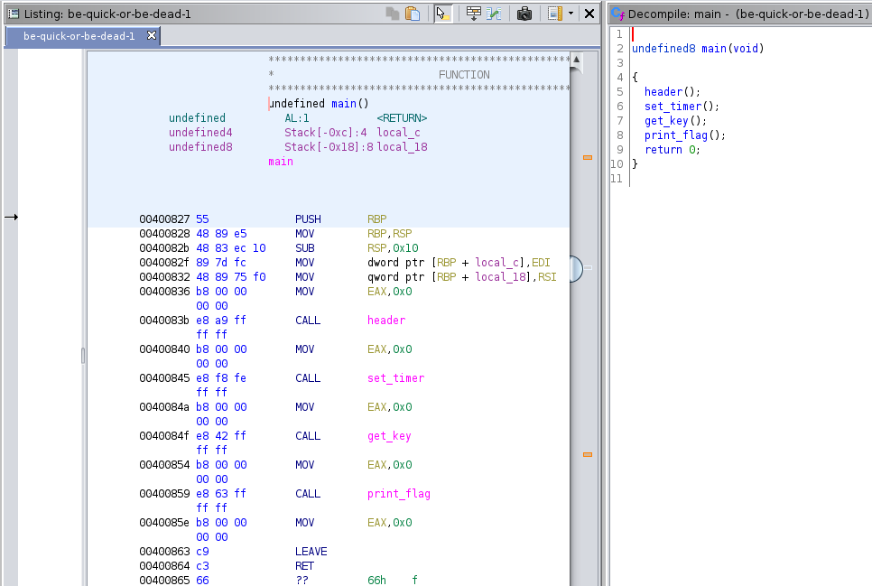

# be-quick-or-be-dead-1 (reversing, 200pts)

> You find [this](https://www.youtube.com/watch?v=CTt1vk9nM9c) when searching for some music, which leads you to
> [be-quick-or-be-dead-1](./assets/be-quick-or-be-dead-1). Can you run it fast enough?

Running [`file`](https://linux.die.net/man/1/file), we see this is a 64-bit ELF binary:

```sh
$ file be-quick-or-be-dead-1
reversing-be-quick-or-be-dead-1/assets/be-quick-or-be-dead-1: ELF 64-bit LSB executable, x86-64, version 1 (SYSV),
dynamically linked, interpreter /lib64/l, for GNU/Linux 2.6.32, BuildID[sha1]=4b1c5a467d8eeed08586b5cb12da1b5593e3e28a,
not stripped
```

Mark the binary as executable and run it:

```sh
Be Quick Or Be Dead 1
=====================

Calculating key...
You need a faster machine. Bye bye.
```

The program accepts no arguments and always tells us we need a faster machine. Open the binary in
[Ghidra](https://github.com/NationalSecurityAgency/ghidra) to take a look at what it's doing:



We see calls to several functions - click through each one to find out what they're doing:

* `header` Prints the first 3 lines of the output above
* `set_timer` sets an [alarm](https://linux.die.net/man/3/alarm) to call `alarm_handler` after 1 second
  * `alarm_handler` prints the text `You need a faster machine. Bye bye.` and calls `exit(0)` to exit the program
* `get_key` calculates a key and puts the result into the variable `key`
* `print_flag` decrypts the flag using `key` then prints it

Knowing this, it's clear that the alarm handler is being called before the key is calculated, so we never get the flag.

There are several ways to solve this:

* **Calling functions directly using `gdb`**

  The program still contains symbols (e.g. function names), so we can easily call the `get_key` and `print_flag`
  functions directly:
  
  ```
  $ gdb be-quick-or-be-dead-1
  > break main
  > run
  Breakpoint 1, 0x000000000040082b in main ()
  > call get_key()
  Calculating key...
  Done calculating key
  $1 = 0x15
  > call print_flag()
  Printing flag:
  picoCTF{why_bother_doing_unnecessary_computation_402ca676}
  $2 = 0x3b
  ```

* **Setting the value of `key` using `gdb`**
  
  Inspecting the code for the `calculate_key` function, we see that the loop exits when the key is equal to `0xeb866516`
  and this is the value that `key` is set to:
  
  ```  
  00400706 55              PUSH       RBP
  00400707 48 89 e5        MOV        RBP,RSP
  0040070a c7 45 fc        MOV        dword ptr [RBP + local_c],0x75c3328b
           8b 32 c3 75
                       LAB_00400711                                    XREF[1]:     0040071c(j)  
  00400711 83 45 fc 01     ADD        dword ptr [RBP + local_c],0x1
  00400715 81 7d fc        CMP        dword ptr [RBP + local_c],0xeb866516
           16 65 86 eb
  0040071c 75 f3           JNZ        LAB_00400711
  0040071e 8b 45 fc        MOV        EAX,dword ptr [RBP + local_c]
  00400721 5d              POP        RBP
  00400722 c3              RET
  ```
  
  Knowing this, we can simply set `key` to `0xeb866516` to avoid the unnecessary computation.  Find the address of `key`
  and then use `gdb` as before:
  
  ```
  $ objdump -t be-quick-or-be-dead-1 | grep key
  00000000006010c0 g     O .bss	0000000000000004              key
  
  $ gdb be-quick-or-be-dead-1
  > break main
  > run
  Breakpoint 1, 0x000000000040082b in main ()
  > whatis *0x6010c0
  type = int
  > set {int}0x6010c0=0xeb866516
  > call print_flag()
  Printing flag:
  picoCTF{why_bother_doing_unnecessary_computation_402ca676}
  $2 = 0x3b
  ```

  * **Patching the binary using [`pwntools`](http://docs.pwntools.com/en/stable/)**
  
  We can also patch the binary to achieve the same result but in a more consistent and automated manner.
  
  Patch the `calculate_key` function to simply return the value `0xeb866516`, which removes the calculations that were
  being performed:
  
  ```python
  from pwn import *

  context.log_level = 'critical'
  
  elf = ELF('./be-quick-or-be-dead-1')
  
  elf.asm(elf.symbols['calculate_key'], 'mov eax,{0}\nret'.format(0xeb866516))
  
  elf.save('./patched')
  os.chmod('./patched', 0775)
  
  p = process('./patched')
  print p.recvall()
  ```
  
  Executing this gets us the flag:
  
  ```
  $ python2 patch.py 
  Be Quick Or Be Dead 1
  =====================
  
  Calculating key...
  Done calculating key
  Printing flag:
  picoCTF{why_bother_doing_unnecessary_computation_402ca676}
  ``` 
