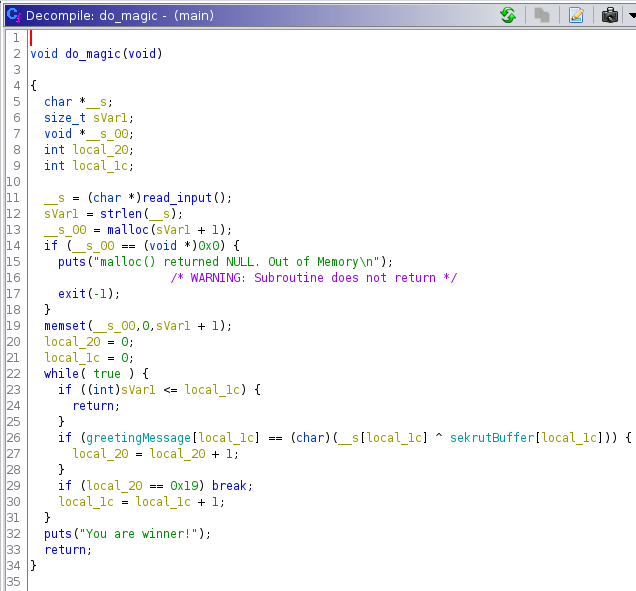

# quackme (reversing, 200pts)

> Can you deal with the Duck Web? Get us the flag from this [program](./assets/main).

Running [`file`](https://linux.die.net/man/1/file), we see this is a 32-bit ELF binary:

```
$ file main
main: ELF 32-bit LSB executable, Intel 80386, version 1 (SYSV), dynamically linked, interpreter /lib/ld-, for GNU/Linux
2.6.32, BuildID[sha1]=b830e63a4a15c7051882bf03e1fa8f6abf3b7950, not stripped
```

Mark the binary as executable and run it:

```
$ ./main
You have now entered the Duck Web, and you're in for a honkin' good time.
Can you figure out my trick?
test
That's all folks.
```

The program accepts input after asking for a trick and prints `That's all folks` when the input is incorrect. Open the
binary in [Ghidra](https://github.com/NationalSecurityAgency/ghidra) to take a look at what it's doing:



The `main` function simply prints the intro text and calls `do_magic`, which contains the main logic for the binary.
This function reads input from the user, then enters a while loop that XORs each character with a character from an
array `sekrutBuffer` and compares it to the character at the same position in `greetingMessage`.  This is done 25 times
as the loop breaks once the counter reaches 0x19.

Following the labels, we find the values:

* **greetingMessage:** `You have now entered the Duck Web, and you're in for a honkin' good time.\nCan you figure out my trick?`
* **sekrutBuffer (hex):** `\x06\x16\x4f\x2b\x35\x30\x1e\x51\x1b\x5b\x14\x4b\x08\x5d\x2b\x56\x47\x57\x50\x16\x4d\x51\x51\x5d\x00`

XOR the first 25 characters from each to get the flag:

```js
const greetingMessage = `You have now entered the Duck Web, and you're in for a honkin' good time.\nCan you figure out my trick?`;
const sekrutBuffer = '\x29\x06\x16\x4f\x2b\x35\x30\x1e\x51\x1b\x5b\x14\x4b\x08\x5d\x2b\x56\x47\x57\x50\x16\x4d\x51\x51\x5d\x00';
let result = '';

for (let i = 0; i < 25; i++) {
  result += String.fromCharCode(greetingMessage.charCodeAt(i) ^ sekrutBuffer.charCodeAt(i));
}

console.log(result);
picoCTF{qu4ckm3_35246994}
```
