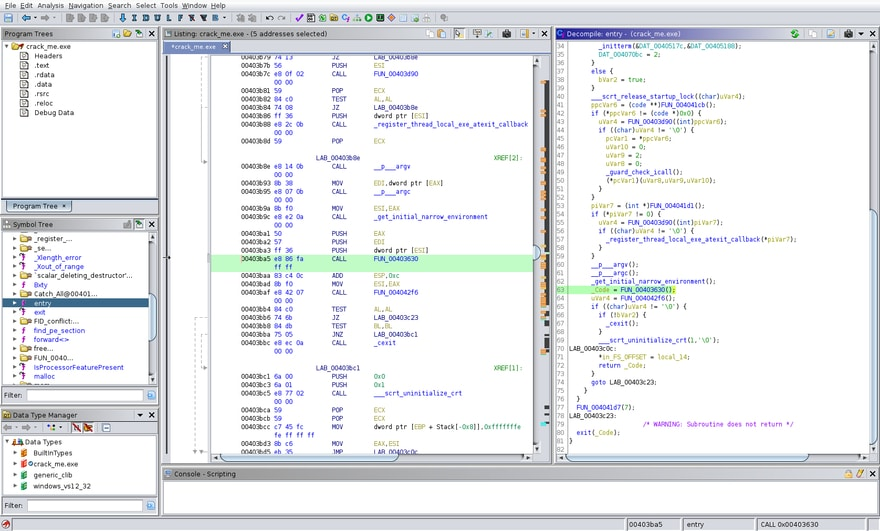

# crack_me (reversing)

> Do you have a key?

Running `file` on the executable, you can see this is a Windows console executable:
```bash
$ file crack_me.exe
crack_me.exe: PE32 executable (console) Intel 80386, for MS Windows
```

To gather some context, run this in Windows.  You're prompted to enter a key.  If you try a random string of characters,
the console application prints `Invalid key!` and exits.
```bash
$ ./crack_me.exe
Enter a key: test
Invalid key!
```

As this is a reversing challenge static analysis would be helpful.  I typically use a combination of
[Ghidra](https://github.com/NationalSecurityAgency/ghidra) and [Hopper](https://www.hopperapp.com/).
If you open the file in Ghidra you'll see a symbol called `entry` is loaded, which looks like the entrypoint to the
application.  Decompiling the function we can see that this is just a wrapper for our application.  There's a variable
already named `_Code`, which looks like it probably calls into the application code.



Clicking through to function `FUN_00403630`, we see that our assumption is correct - there's a call to prompt for the
user to enter a key and much more.
```c
setlocale(0,"Russian");
FUN_004022c0((int)local_2c);
local_8 = 0;
FUN_00401440((int *)cout_exref,"Enter the key: ");
FUN_004013f0(cin_exref,local_2c);
local_34 = FUN_00403310(local_2c,"_",0);
if ((local_34 == -1) || (iVar2 = FUN_00403310(local_2c,"_",local_34 + 1), iVar2 == -1)) {
  FUN_004032f0();
}
iVar2 = FUN_004033f0(local_2c);
if (iVar2 != 0xf) {
  FUN_004032f0();
}
pcVar8 = (char *)FUN_00402850(local_2c,0);
if (*pcVar8 != 'r') {
  FUN_004032f0();
}
pcVar8 = "everse";
local_3c = FUN_004035a0(local_2c,local_64,1,6);
local_8._0_1_ = 1;
local_38 = local_3c;
uVar3 = operator!=<>(local_3c,pcVar8);
local_2d = (char)uVar3;
local_8 = (uint)local_8._1_3_ << 8;
~_String_alloc<>(local_64);
if (local_2d != '\0') {
  FUN_004032f0();
}
pcVar8 = (char *)FUN_00402850(local_2c,8);
if (*pcVar8 == 'i') {
  pcVar8 = (char *)FUN_00402850(local_2c,8);
  cVar1 = *pcVar8;
  pcVar8 = (char *)FUN_00402850(local_2c,9);
  if ((int)cVar1 + (int)*pcVar8 == 0xdc) goto LAB_00403782;
}
fail();
LAB_00403782:
  ...
```
From this snippet, we can see:
* The locale is set to Russian.  Probably not relevant as this event is organised by a Russian university
* `FUN_00401440` prints to standard out
* `FUN_004013f0` reads from standard in and puts the result in `local_2c`
* `FUN_00403310` looks like it's looking for the first index of a character in a string
* `FUN_004032f0` is called in several condition blocks, so is likely used to short-circuit the application if a
condition is not met - clicking through, you'll see a call to print `Invalid key!` to the console and a call to
`exit(0)` to exit the application
* `FUN_004033f0` looks like a length check - the condition that follows checks if the return value is `0xf`
* `FUN_00402850` looks like a call to get the character at an index
* `FUN_004035a0` is less obvious but looks like a substring function

Knowing all of this, we can change the variable and function names using `L` to make the code easier to read:
```c
setlocale(0,"Russian");
FUN_004022c0((int)inputKey);
local_8 = 0;
print((int *)cout_exref,"Enter the key: ");
readString(cin_exref,inputKey);
underscoreIndex = strpos(inputKey,"_",0);
if ((underscoreIndex == -1) || (iVar2 = strpos(inputKey,"_",underscoreIndex + 1), iVar2 == -1)) {
  fail();
}
inputKeyLength = strlen(inputKey);
if (inputKeyLength != 0xf) {
  fail();
}
charAtIndex0 = (char *)charAt(inputKey,0);
if (*charAtIndex0 != 'r') {
  fail();
}
pcVar8 = "everse";
local_3c = substring(inputKey,local_64,1,6);
local_8._0_1_ = 1;
local_38 = local_3c;
uVar3 = operator!=<>(local_3c,pcVar8);
local_8 = (uint)local_8._1_3_ << 8;
~_String_alloc<>(local_64);
if ((char)uVar3 != '\0') {
  fail();
}
pcVar8 = (char *)charAt(inputKey,8);
if (*pcVar8 == 'i') {
  pcVar8 = (char *)charAt(inputKey,8);
  cVar1 = *pcVar8;
  pcVar8 = (char *)charAt(inputKey,9);
  if ((int)cVar1 + (int)*pcVar8 == 0xdc) goto LAB_00403782;
}
fail();
LAB_00403782:
...
```
This is much easier to read, and we can now determine that the key:
* Contains 2+ underscores
* Is 15 (`0xf`) characters long
* Has `r` as the first character
* Has `everse` after `r`
* The character at index 8 is `i`
* The character at index 9 is `s` (`*pcVar8 = 0xdc - cVar1`, where `cVar1` is `0x69`, the hex char code of `i`)

The key therefore starts with `reverse_is` (we don't know for certain that the `_` is there, but it would be consistent
with the typical flag format).

The next section is interesting, because it isn't a straight character/string comparison.  Ghidra also gets the first
few lines wrong in its disassembly (e.g. `local_4c = &stack0xffffff5c` should be `local_4c = 0xfffffff5`, so I've
cleaned that up below (this is also a good reason to make use of multiple tools):
```c
LAB_00403782:
  pcVar8 = "fine";
  local_4c = 0xfffffff5;
  substring(inputKey,&stack0xffffff5c,0xb,4);
  local_44 = (void *)FUN_00403090(local_7c);
  local_8._0_1_ = 2;
  local_40 = local_44;
  uVar3 = operator!=<>(local_44,pcVar8);
  local_8 = (uint)local_8._1_3_ << 8;
  ~_String_alloc<>(local_7c);
  if ((char)uVar3 != '\0') {
    fail();
  }
  underscoreIndex = strpos(inputKey,"e",0);
  while (underscoreIndex != -1) {
    puVar7 = (undefined *)charAt(inputKey,underscoreIndex);
    *puVar7 = 0x33;
    underscoreIndex = strpos(inputKey,"e",0);
  }
  pcVar8 = "}\n";
  puVar7 = inputKey;
  pcVar6 = "InnoCTF{";
  pcVar5 = FUN_00401f80;
  this = (basic_ostream<char,struct_std::char_traits<char>_> *)print((int *)cout_exref,"Success!!!")
  ;
  piVar4 = (int *)operator<<(this,pcVar5);
  piVar4 = (int *)print(piVar4,pcVar6);
  piVar4 = (int *)FUN_00401410(piVar4,puVar7);
  print(piVar4,pcVar8);
  system("pause");
  local_48 = 0;
  local_8 = 0xffffffff;
  ~_String_alloc<>(inputKey);
  *in_FS_OFFSET = local_10;
  FUN_004039b7();
  return;
  ```
There's a reference to the word `fine`,  the number `0xfffffff5`, and 4 characters from index 11 (`0xb`)  of `inputKey`
are extracted.  This is followed by a call to `FUN_00403090`, though Ghidra gets the parameter count wrong in the
disassembled code.  I've extracted the interesting part and replaced `&stack0x00000008` with `keySuffix` (i.e. the
last 4 characters of `inputKey`):
```c
while( true ) {
  uVar1 = strlen(keySuffix);
  if (uVar1 <= local_30) break;
  pcVar2 = (char *)charAt(keySuffix,local_30);
  iVar3 = isupper((int)*pcVar2);
  if (iVar3 == 0) {
    pcVar2 = (char *)charAt(keySuffix,local_30);
    FUN_00402980(local_2c,(char)(((int)*pcVar2 + -0x61 + in_stack_00000020) % 0x1a) + 'a');
  }
  else {
    pcVar2 = (char *)charAt(keySuffix,local_30);
    FUN_00402980(local_2c,(char)(((int)*pcVar2 + -0x41 + in_stack_00000020) % 0x1a) + 'A');
  }
  local_30 = local_30 + 1;
}
```
The loop here iterates over each character and applies some simple math operations using values depending on the
character case.  This looks similar to a shift cipher.  Taking the lowercase expression for example:
```c
pcVar2 = (char *)charAt(keySuffix,local_30);
FUN_00402980(local_2c,(char)(((int)*pcVar2 + -0x61 + in_stack_00000020) % 0x1a) + 'a');
```
This translates to the equivalent JavaScript code:
```js
const charCode = keySuffix.charCodeAt(i);
FUN_00402980(local_2c, String.fromCharCode(((charCode - 0x61 + in_stack_00000020) % 0x1a) + 0x61);
```
It's not obvious where `in_stack_00000020` comes from, so look at the assembly code:
```
0x0040314e	MOV	ECX, dword ptr [EBP + Stack[0x20]]
0x00403151	LEA	ECX, [EAX + ECX*0x1 + -0x61]
...
```
The value of `ECX` comes from a reference to the stack used by the previous function.  You can get the value by setting
a breakpoint using a debugger like [x32dbg](https://github.com/x64dbg/x64dbg), or recall that the value `0xfffffff5` was
defined immediately after the string `fine`.  Be careful with how your translate this into code because we're working
with 32-bit values and the result will overflow.  Our cipher becomes:
```js
function encode(charCode) {
  // bitwise AND with 0xffffffff to make the result a 32-bit value
  return ((charCode - 0x61 + 0xfffffff5) & 0xffffffff) % 0x1a + 0x61;
}
```
This makes the key trivial to bruteforce, and we end up with the value `qtyp`.

Our key is now `reverse_is_qtyp`, which satisfies the constraints we defined earlier  - it has 2+ underscores and is 15
characters long.  Entering this into the application:
```bash
$ ./crack_me.exe
Enter a key: reverse_is_qtyp
Success!!!
InnoCTF{r3v3rs3_is_qtyp}
```
